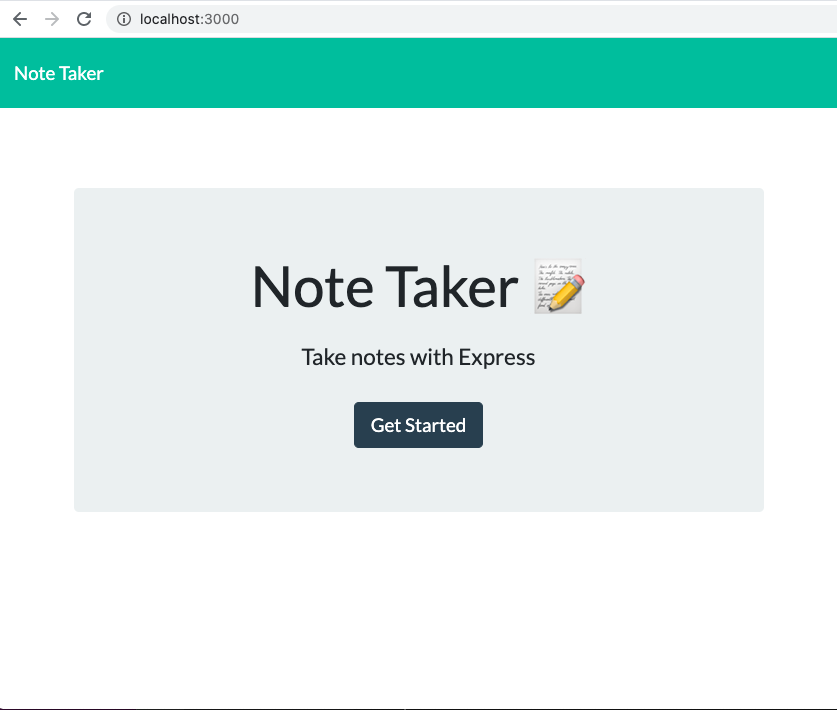
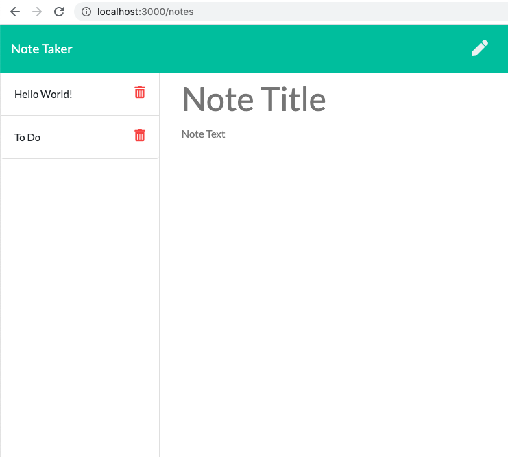

# Jot This Down

<span align="left">

<a href="https://img.shields.io/badge/License-MIT-brightgreen?style=plastic"></a>

 </span>
 
## Description

A simple note-taking application that utilizes Node.js and Express.js

View the application [here](https://jot-this-down.herokuapp.com/).

View the repository on [GitHub](https://github.com/dsmooke/jot-this-down)

## Overview

In this unit, we will create our own server-side APIs using the Express.js framework. Express is the most widely used Node.js server framework. It will allow us to quickly and easily establish our API routes and associated HTTP request methods.

Routing is how we design our server to handle responses when a client makes a request at a specific endpoint, or URL. We learned how to make GET requests from the client-side in a previous unit. Now we will learn how those requests are handled on the server-side. Our server will _listen_ for a specific type of request at a specific endpoint and when it _hears_ that request, it will respond accordingly.

We will also learn the HTTP POST request method to submit data to our server.

### Technologies Used

* http

* Express.js

* Routing

* Postman

* HTTP POST requests

* Express.static()

## Goals

1. To create an application that can be used to write, save, and delete notes.
2. To have the application use an express backend and save and retrieve note data from a JSON file.
3. To build the backend and connect it with the frontend which has already been created. 

## Instructions

1. Create the following HTML routes:

  * GET `/notes` - Should return the `notes.html` file.

  * GET `*` - Should return the `index.html` file


2. Create a `db.json` file on the backend of the application that will be used to store and retrieve notes using the `fs` module.

3. Create the following API routes:

  * GET `/api/notes` - Should read the `db.json` file and return all saved notes as JSON.

  * POST `/api/notes` - Should receive a new note to save on the request body, add it to the `db.json` file, and then return the new note to the client.

  * DELETE `/api/notes/:id` - Should receive a query parameter containing the id of a note to delete. This means you'll need to find a way to give each note a unique `id` when it's saved. In order to delete a note, you'll need to read all notes from the `db.json` file, remove the note with the given `id` property, and then rewrite the notes to the `db.json` file.

### User Story
```
AS A user, I want to be able to write and save notes

I WANT to be able to delete notes I've written before

SO THAT I can organize my thoughts and keep track of tasks I need to complete
```

### Business Context - Developer/Usage

For users that need to keep track of a lot of information, it's easy to forget or be unable to recall something important. Being able to take persistent notes allows users to have written information available when needed.

Postman was used to check the `GET`, `POST`, and `DELETE` requests.




## Acceptance Criteria
```
Application should allow users to create and save notes.

Application should allow users to view previously saved notes.

Application should allow users to delete previously saved notes.
```

## Bugs

I tried to deploy the application to Heroku, but the URL is not loading and returns: "Application error." With the hope that I must have skipped a step when setting up the app, I deleted the application and started over. I again created a new app and followed the following [directions](https://www.freecodecamp.org/news/how-to-deploy-a-nodejs-app-to-heroku-from-github-without-installing-heroku-on-your-machine-433bec770efe/). Even after taking these steps to deploy, the application URL still did not load. 

## Credits

[Express JS Crash Course](https://www.youtube.com/watch?v=L72fhGm1tfE)
[Heroku Deploy App Instructions](https://www.freecodecamp.org/news/how-to-deploy-a-nodejs-app-to-heroku-from-github-without-installing-heroku-on-your-machine-433bec770efe/)

## Contact

[Dana Smooke]("https://github.com/dsmooke")

## License

[MIT]("https://opensource.org/licenses/MIT")

---
© 2021 Trilogy Education Services, LLC, a 2U, Inc. brand. Confidential and Proprietary. All Rights Reserved.


